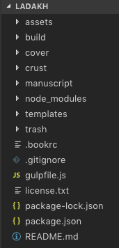
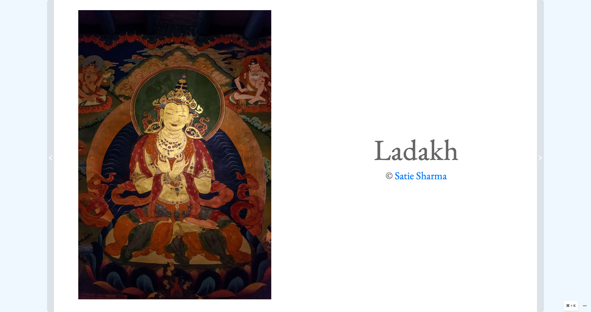

## Introduction

This is an article on how I wrote a [photo book about Ladakh](https://bubblin.io/book/ladakh-by-satie-sharma/1) on [bubblin](https://www.bubblin.io).

Bubblin provides two methods for writing books -
* a simple [online web editor](https://bubblin.io/docs/tutorial) for writing simple short books
* a powerful desktop book writing tool called [bookiza](https://bookiza.io)

I chose `bookiza` to write my book as it provides more control over the writing process.

## Setup

To setup the book writing environment with `bookiza`, the following tools are required. I am a Mac user so the instructions below are for macOS.

##### NodeJS 
Install with [homebrew](https://brew.sh)

```console
$ brew install node
```

##### git 
If you have Xcode command line tools installed, then you already have git. Otherwise, you can install git from [here](https://git-scm.com/download/mac).

##### bookiza

```console
$ npm -i g bookiza
$ bookiza --version
0.0.50
```

[Sign up](https://bubblin.io/users/new) for an account on bubblin and register bookiza.

```console
$ bookiza register
username: satie
password: *****************

Registration successful.
```

## Layout

The content of my book consists mainly of photographs. There is very little text. As such, a simple layout template was selected for the book.

```console
$ bookiza new ladakh --leafs 50 --template magazine
```
This created a book with 100 pages (each leaf is 2 pages) with the following directory structure



#### Template

The `templates` directory contains `html`, `javascript` and `css` that gets applied to all the pages in the book. In this case, the files in this directory are empty to begin with. 

The [EB Garamond](https://fonts.google.com/specimen/EB+Garamond) font was selected to be applied across the book and imported in the `style.css`. Common style elements to be applied to the body of all html pages were defined in this file as well.

```css
@import url('//fonts.googleapis.com/css?family=EB+Garamond:400,400i');
html,
body {
    background: #fff;
    margin: 0 0;
    overflow: hidden;
    color: #666;
    font: 4.4vw/1.20 'EB Garamond', serif;
    height: 100vh;
    width: 100vw;
    background-repeat: no-repeat;
    background-size: 100% 100%;
}
```

#### Covers

The `manuscript` directory contains directories for individual pages of the book. `page-1` is the front cover and `page-100` is the back cover. Similarly, front inside cover is `page-2` and back inside cover is `page-99`.

Within the `page-1` directory is are `html` and `css` files for the content and style for the cover. `body.html` contains the title and subtitle for the book

```html
<div class="face">
    <div class="top flex">
        <div>
            <h1 class="title"> ladakh </h1>
            <h2 class="subtitle"> A Journey to Little Tibet </h2>
            <hr/>
        </div>
    </div>
    <div class="bottom flex ">
        <div> © Satie Sharma </div>
    </div>
</div>
```

`style.css` contains the CSS applied to `page-1` in addition to the CSS defined in the `template` above

```css
html,
body {
    height: 100vh;
    width: 100vw;
    margin: 0;
}

.face:before {
    content: "";
    position: fixed;
    left: 0;
    right: 0;
    z-index: -1;
    background-image: url(https://res.cloudinary.com/satie/image/upload/c_fill,f_auto,q_auto/v1517241523/nature/PangongSunset01);
    background-position: center center;
    height: 100vh;
    width: 100vw;
    background-size: 100% 100%;
    -webkit-filter: blur(0px);
    -moz-filter: blur(0px);
    -o-filter: blur(0px);
    -ms-filter: blur(5px);
    filter: blur(0px);
    -moz-transition: all 300ms;
    -o-transition: all 300ms;
    -webkit-transition: all 300ms;
    transition: all 300ms;
}
.
.
.
```

The front and back covers use fullbleed background images that span the entire page with the title and subtitle overlayed on top of it.


The front inside cover is another image though not fullbleed but justified with the some space all around. As this is a design that is used in multiple pages, CSS for `page-2` is defined in the template. `page-3` is just a simple text title. 

```css
.leaf {
    height: 100%;
    height: 100vh;
    width: 80%;
    margin: auto;
}

.inner {
    width: 100%;
}

.flex {
    display: -webkit-box;
    display: flex !important;
    align-items: center;
    justify-content: center;
}

.justify {
    text-align: justify;
}
```

`body.html` for `page-2` just has a `div` element to display the image

```html
<div class="leaf flex">
    <div class="inner justify ">
        
    </div>
</div>
```



#### Page layout

The layout was designed to look similar to a coffee table book with some pages with just a single photo and others with multiple. 


Some photos are fullbleed taking up two middle pages like a center spread.


* manuscript - sections
* bookiza server

## Issues

* bookiza performance with large number of pages
* image load performance (move to cloudinary)

## Conclusion

* improvements